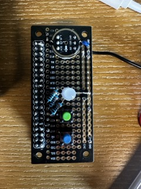

# Raspberry Pi Audio Logger Wiring Instructions

This guide explains how to connect the electronics on the breadboard. A full list of parts is available in [parts_list.md](parts_list.md).



## Wiring Diagram

### INMP441 Microphone (I2S)

| INMP441 Pin | Raspberry Pi Pin | Function    |
| ----------- | ---------------- | ----------- |
| VCC         | Pin 1 (3.3V)     | Power       |
| GND         | Pin 6 (GND)      | Ground      |
| WS (L/R)    | Pin 35 (GPIO19)  | Word Select |
| SCK         | Pin 12 (GPIO18)  | Bit Clock   |
| SD          | Pin 38 (GPIO20)  | Data        |

> Note: You may need to enable I2S in `/boot/config.txt`:
>
> ```
> dtparam=i2s=on
> ```

---

### RGB LED (Common Cathode)

| LED Pin | Resistor | Raspberry Pi Pin | GPIO   | Color  |
| ------- | -------- | ---------------- | ------ | ------ |
| R       | 330Ω     | Pin 18           | GPIO24 | Red    |
| G       | 330Ω     | Pin 16           | GPIO23 | Green  |
| B       | 330Ω     | Pin 15           | GPIO22 | Blue   |
| Cathode | None     | Pin 14 (GND)     | GND    | Ground |

---

### Buttons

| Button | Raspberry Pi Pin | GPIO   | Function          |
| ------ | ---------------- | ------ | ----------------- |
| 1      | Pin 11           | GPIO17 | Upload trigger    |
| 2      | Pin 13           | GPIO27 | Highlight trigger |

Use internal pull-up resistors; buttons should connect GPIO to **GND** when pressed.

---

## Power

- You can power the Pi using a 5V lithium battery (e.g., 18650 with regulator) connected to:
  - **Pin 2 or 4** (5V)
  - **Pin 6** (GND)

Alternatively, power via USB as usual.

